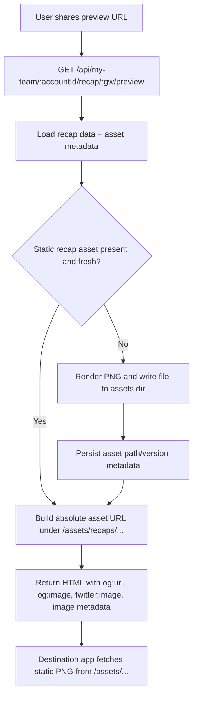

# fix: Make shared gameweek recap images fetchable by social scrapers

## Overview

Gameweek sharing already routes X/WhatsApp/Telegram through a `/preview` page that emits `og:image` and `twitter:image`, but those tags still point at a dynamic `/api/my-team/:accountId/recap/:gw` renderer. That keeps the URL shape simple for the app, yet it asks destination apps and social scrapers to fetch an on-demand image render instead of a stable public asset.

The fix is to materialize each recap card to a real file under the existing `/assets` static-serving surface, then make the preview page publish that asset URL in its meta tags. The current recap API route can stay as a compatibility layer, but scraper-facing metadata should point to a static image URL that is fast, cacheable, independently fetchable, and always built from the actual request origin.

## Problem Frame

The user-visible bug is not the share dialog itself. The remaining failure is the handoff after sharing:

- The destination app opens the shared preview URL.
- It parses the preview page’s Open Graph or Twitter card tags.
- It fetches the `og:image` URL.

Right now, that `og:image` URL is a dynamic API endpoint. If the scraper is sensitive to latency, redirects, render errors, or non-static image URLs, the share unfurl can fail even though the preview page contains the correct tags.

This plan makes the image fetch path behave more like the repo’s existing player/team image assets: a plain file served from `/assets/...`, backed by deterministic cache and invalidation rules.

## Requirements Trace

- R1. Shared gameweek recap links must expose an `og:image` URL that destination apps can fetch directly after reading the shared page’s meta tags.
- R2. The scraper-facing image URL must be absolute, public, and stable enough for Open Graph and Twitter-card consumers.
- R3. Absolute URLs emitted by the preview page must always resolve against the actual request origin for the current environment, including forwarded host/protocol behind the proxy, such as `http://localhost` in local development and `https://fplytics-dev.ianha.com` in hosted environments.
- R4. Existing share UI behavior should remain compatible: the dialog preview, copy/download flow, and social deep links should continue to work without requiring product-level changes.
- R5. Recap images must refresh when the underlying synced gameweek data changes, rather than serving stale files forever.
- R6. The implementation should follow existing repo patterns for locally materialized assets and static serving.

## Scope Boundaries

- No redesign of the share dialog UI.
- No new social platforms or product copy changes beyond what is required for fetchability.
- No background job system or async queue for recap image generation in this iteration.
- No attempt to guarantee every platform’s private caching behavior; the goal is a correct, fetchable share surface on our side.

## Context & Research

### Relevant Code and Patterns

- `apps/web/src/components/ui/ShareRecapDialog.tsx` already sends X/WhatsApp/Telegram to `/api/my-team/:accountId/recap/:gw/preview`.
- `apps/api/src/routes/createApiRouter.ts` already serves both `/preview` HTML and the dynamic PNG endpoint.
- `apps/api/src/app.ts` already serves local assets from `app.use("/assets", express.static(env.assetsDir))`.
- `apps/api/src/services/assetSyncService.ts` is the strongest local pattern for materializing remote/generated images to disk and surfacing them via `/assets/...`.
- `apps/api/src/db/database.ts` and `apps/api/src/db/schema.ts` use additive schema evolution via `ensureColumns`, which fits recap asset metadata if we need persistence.
- `apps/api/test/recapPreviewRoute.test.ts` already covers the preview route and should be extended rather than replaced.

### Institutional Learnings

- No `docs/solutions/` entries or brainstorm requirements docs were present for this issue in the repo.
- The prior completed share plans on 2026-03-24 are still useful prior art, but the current bug is narrower: fetchability of the scraper-facing image URL after those changes shipped.

### External References

- Open Graph protocol guidance expects `og:image` to be a concrete HTTP(S) image URL and recommends structured image metadata such as width, height, type, and secure URL: [ogp.me](https://ogp.me/).
- Proceeding without broader external research because the repo already has strong local patterns for static asset serving, and the remaining work is primarily architectural within this codebase.

## Key Technical Decisions

- Publish a static asset URL in `og:image` instead of the dynamic recap route: this directly addresses fetchability for destination apps and mirrors the repo’s existing `/assets` pattern.
- Generate recap assets lazily on request rather than adding a background pipeline: the recap preview route is already the handoff point for scraper traffic, so it is a natural place to ensure the asset exists before emitting meta tags.
- Persist recap asset versioning metadata with the gameweek row: this gives us deterministic stale-file detection without requiring brittle filesystem-only heuristics.
- Keep the existing `/api/my-team/:accountId/recap/:gw` route for compatibility: the web dialog currently previews, downloads, and copies through that path, so the safer fix is to improve the backing implementation rather than change every consumer at once.
- Build all absolute share metadata URLs from the current request origin and forwarded proxy headers, not from a separate configured public URL: this keeps the metadata aligned with the real host serving the request and avoids environment drift.

## Open Questions

### Resolved During Planning

- Should we update the previous completed plan in place? No. The earlier plan described the share UX transition; this plan targets the narrower residual production bug in the current implementation.
- Does this need a new product flow? No. The bug can be fixed behind the existing share surfaces.
- Is external research necessary before planning? No. Local code already shows the right static asset pattern to follow.

### Deferred to Implementation

- Exact file naming/versioning shape for recap assets: whether versioning lives in the filename, a query param, or both can be finalized during implementation as long as stale-cache busting is explicit.
- Whether the compatibility recap route should `sendFile`, stream the generated file, or redirect to the static asset once materialized: all three preserve behavior, and the final choice can be made while coding against tests.

## High-Level Technical Design

> *This illustrates the intended approach and is directional guidance for review, not implementation specification. The implementing agent should treat it as context, not code to reproduce.*

## Implementation Units

- [x] **Unit 1: Add recap asset materialization and freshness tracking**

**Goal:** Introduce a server-side path for writing recap PNGs to disk and deciding whether an existing file is still valid for a given account/gameweek.

**Requirements:** R1, R5, R6

**Dependencies:** None

**Files:**
- Modify: `apps/api/src/services/recapCardService.ts`
- Modify: `apps/api/src/db/database.ts`
- Modify: `apps/api/src/db/schema.ts`
- Test: `apps/api/test/recapPreviewRoute.test.ts`
- Test: `apps/api/test/assetSyncService.test.ts` (pattern reference only if a dedicated recap-asset test file is not introduced)

**Approach:**
- Extend the recap service with a “materialize asset” capability that can:
  - derive a deterministic freshness key from the recap payload,
  - ensure an `assets/recaps/` subdirectory exists,
  - render the PNG once when missing or stale,
  - return the relative `/assets/...` path for downstream callers.
- Add additive columns on `my_team_gameweeks` for recap asset bookkeeping so the server can detect when stored assets no longer match current data.
- Keep the freshness key tied to recap content, not just the account/gameweek tuple, so a resync can invalidate the prior asset cleanly.

**Patterns to follow:**
- `apps/api/src/services/assetSyncService.ts`
- `apps/api/src/db/database.ts`

**Test scenarios:**
- First request for a recap with no asset metadata creates the file and stores metadata.
- Second request with unchanged recap data reuses the existing asset without re-rendering.
- Changed recap data forces a new asset version or overwrite path rather than returning stale metadata.
- Missing recap data still returns `404` without writing files.

**Verification:**
- A recap asset exists on disk under the static assets directory after preview generation.
- The service can distinguish reusable versus stale assets deterministically.

- [x] **Unit 2: Make the preview route publish the static asset URL in share metadata**

**Goal:** Ensure `/preview` emits meta tags that point scrapers at a directly fetchable static image file rather than the dynamic recap endpoint.

**Requirements:** R1, R2, R3, R5

**Dependencies:** Unit 1

**Files:**
- Modify: `apps/api/src/routes/createApiRouter.ts`
- Test: `apps/api/test/recapPreviewRoute.test.ts`

**Approach:**
- Update the preview route to materialize or resolve the recap asset before generating HTML.
- Set `og:image`, `og:image:secure_url`, `og:image:type`, `og:image:width`, `og:image:height`, `og:image:alt`, and `twitter:image` from the static asset URL.
- Add `og:url` for the preview page itself so the shared object has a stable canonical URL separate from the image URL.
- Preserve HTML escaping for title/description and make request-origin generation explicit in the route design:
  - derive origin from the incoming request every time,
  - rely on `trust proxy` so hosted proxy traffic emits the forwarded public host/protocol,
  - keep localhost working automatically in development without separate configuration.
- Keep the browser-facing redirect behavior, but make sure it does not undercut scraper parsing of the meta tags.

**Patterns to follow:**
- Existing route structure in `apps/api/src/routes/createApiRouter.ts`
- Current trust-proxy handling in `apps/api/src/app.ts`

**Test scenarios:**
- Preview HTML includes the absolute `/assets/recaps/...` URL rather than `/api/my-team/.../recap/:gw` in `og:image`.
- Preview HTML includes the expected image MIME type and other structured metadata.
- Preview route still returns `400` for invalid params and `404` when recap data is unavailable.
- Preview HTML uses the request origin in local development, including `http://localhost` during local requests.
- Preview HTML respects forwarded host/protocol when the app is behind a reverse proxy and `trust proxy` is enabled.

**Verification:**
- A consumer reading the preview page can fetch the published `og:image` URL directly as a PNG file without hitting the dynamic recap renderer.

- [x] **Unit 3: Preserve compatibility for existing app consumers of the recap image route**

**Goal:** Keep the current web share dialog and recap image actions working while shifting the scraper-facing source of truth to the static asset.

**Requirements:** R4, R5

**Dependencies:** Units 1-2

**Files:**
- Modify: `apps/api/src/routes/createApiRouter.ts`
- Modify: `apps/web/src/components/ui/ShareRecapDialog.tsx`
- Test: `apps/web/src/components/ui/ShareRecapDialog.test.tsx`

**Approach:**
- Decide during implementation whether `/api/my-team/:accountId/recap/:gw` should:
  - serve the materialized asset bytes,
  - redirect to the static asset URL, or
  - continue to render on demand while sharing metadata uses the static URL.
- Keep the dialog’s social deep links pointing at `/preview`, since that remains the metadata page.
- Only adjust the web component if needed to align preview/download/copy behavior with the new asset-backed flow; do not introduce new UX branches unless compatibility requires them.

**Patterns to follow:**
- Existing share dialog behavior in `apps/web/src/components/ui/ShareRecapDialog.tsx`
- Existing preview route tests in `apps/web/src/components/ui/ShareRecapDialog.test.tsx`

**Test scenarios:**
- Share dialog buttons still target the preview URL.
- Copy/download/preview flows still resolve to a valid image resource after the server-side asset change.
- No regression in the dialog’s existing fallback behaviors when native share or clipboard-image APIs are unavailable.

**Verification:**
- The UI continues to work as before from a user perspective while the scraper-facing image path becomes static and fetchable.

- [x] **Unit 4: Add regression coverage for fetchability and cache invalidation**

**Goal:** Lock in the bug fix with tests that prove the preview metadata and resulting image URL are externally consumable.

**Requirements:** R1, R2, R3, R5, R6

**Dependencies:** Units 1-3

**Files:**
- Modify: `apps/api/test/recapPreviewRoute.test.ts`
- Create: `apps/api/test/recapImageAssetRoute.test.ts` (if route-level behavior becomes large enough to justify a dedicated file)
- Modify: `apps/web/src/components/ui/ShareRecapDialog.test.tsx`

**Approach:**
- Add route-level tests that parse the preview HTML, extract the emitted image URL, then fetch that URL from the same app instance and assert PNG content.
- Add at least one stale-data scenario proving that changed recap data updates the asset metadata/path instead of silently serving old output.
- Keep the web tests focused on link shape and compatibility, not server internals.

**Execution note:** Start with failing route-level coverage for the current dynamic `og:image` behavior before changing implementation.

**Patterns to follow:**
- `apps/api/test/recapPreviewRoute.test.ts`
- `apps/web/src/components/ui/ShareRecapDialog.test.tsx`

**Test scenarios:**
- `og:image` extracted from preview HTML is fetchable and returns `200` with `image/png`.
- Asset-backed image requests do not depend on cookies or client-side context.
- Repeated preview requests with unchanged data do not create duplicate files unnecessarily.

**Verification:**
- Tests prove the end-to-end share handoff: preview URL -> metadata -> image fetch.

## System-Wide Impact

- **Interaction graph:** The change touches the share dialog, preview route, recap image route, filesystem asset storage, and `my_team_gameweeks` metadata.
- **Error propagation:** Asset-generation failures should surface as share-preview failures rather than publishing broken image URLs in metadata.
- **State lifecycle risks:** Stale asset metadata or orphaned files are the main lifecycle risks; freshness keys and deterministic file handling should keep this bounded.
- **API surface parity:** The existing recap and preview endpoints remain in place, minimizing frontend churn.
- **Integration coverage:** Unit tests alone are not enough; the route tests need to exercise the exact preview-to-image-fetch path that social apps follow.

## Risks & Dependencies

- Dynamic-to-static migration can create stale file bugs if freshness is keyed too loosely.
- Static assets can accumulate over time if versioned filenames are used without cleanup; the first iteration should choose the simplest safe strategy and document cleanup implications.
- Public-origin construction depends on the proxy forwarding the public host/protocol correctly; this plan assumes the app’s existing `trust proxy` setting remains in place and deployment preserves those headers.
- Some platforms cache unfurls aggressively; the implementation should ensure our output is correct even if downstream refresh timing varies.

## Documentation / Operational Notes

- Update README only if needed to clarify that share metadata URLs are derived from the incoming request origin and forwarded proxy headers.
- If recap assets are versioned rather than overwritten, note any expected disk-growth behavior for operators.

## Sources & References

- Related code: `apps/api/src/routes/createApiRouter.ts`
- Related code: `apps/api/src/services/recapCardService.ts`
- Related code: `apps/api/src/services/assetSyncService.ts`
- Related test: `apps/api/test/recapPreviewRoute.test.ts`
- Prior plans: `docs/plans/2026-03-24-001-feat-share-recap-card-dialog-plan.md`
- Prior plans: `docs/plans/2026-03-24-002-feat-share-embed-image-not-link-plan.md`
- External docs: [Open Graph protocol](https://ogp.me/)
